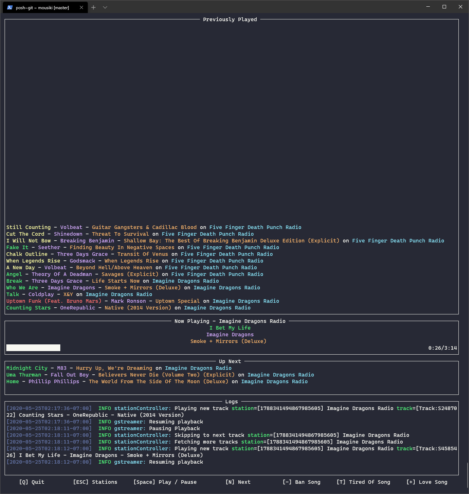

# Mousiki

[](https://github.com/nlowe/mousiki/actions)  [](./LICENSE) [](https://goreportcard.com/report/github.com/nlowe/mousiki)

A command-line pandora client. Inspired by [PromyLOPh/pianobar](https://github.com/PromyLOPh/pianobar).



## Installation

Right now you have to build from source. See [Building](#building).

Mousiki relies on FFmpeg for audio transcoding. Install it from your package manager or from
https://ffmpeg.org/download.html.

## Usage

Start `mousiki` with the `--username` parameter, you will be prompted for
your password:

```bash
$ mousiki --username somebody@gmail.com
Password:
```

### Transport Controls

`mousiki` currently supports the following controls:

| Key | Action |
| --- | ------ |
| `N` | Skip to the next track (or fetch more tracks if the queue is empty |
| `E` | Explain why pandora picked the currently playing track |
| `<space>` | Pause / Resume playback |
| `+` | Love Song |
| `-` | Ban Song |
| `t` | Tired of Song |
| `esc` | Station Picker |
| `Q` / `Ctrl+C` | Quit |

## TODO

In no particular order:

* Publish binaries to GitHub
* Feedback Management (Thumbs Up/Down tracks) for recently played tracks
* Skip ads / artist messages automatically
* Audio quality selection / Support for premium qualities

Maybe some day:

* FFmpeg streaming. Right now we have to transcode the entire track before `github.com/faiface/beep/wav` will even consider playing it
* OSC / HTTP API for controlling playback / running a playback server / writing custom frontends

## Building

You need Go 1.16+.

See [`.github/workflows/ci.yaml`](.github/workflows/ci.yaml) for a rough idea of what to install.

```bash
# Linux / Unix / macOS
go build -o mousiki main.go

# Windows
go build -o mousiki.exe main.go
```

## License

This plugin is published under the MIT License. See [`./LICENSE`](./LICENSE) for details.
